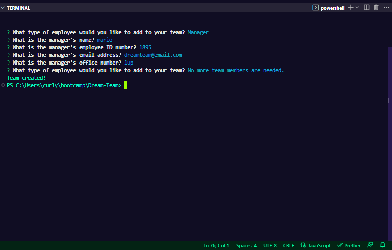

# 'Dream-Team' Employee Summary Generator
This Node.js command-line application takes in information about employees on a software engineering team, and generates an HTML webpage that displays the user input data. The application uses Constructors and Classes to create the employee objects, including the Employee, Manager, Engineer, and Intern classes.

The application also includes unit tests for every part of the code to ensure that it passes each test. Jest and Inquirer are used to conduct these tests.

## Installation
To install the necessary dependencies, run the following command:

## npm install
This will install the necessary packages, including Inquirer and Jest.

## Usage
To use the application, run the following command:

## node index.js or npm start
This will launch the command-line interface and prompt the user for information about their team members.

After entering all the necessary information, the application will generate an HTML file that displays the team members and their information.

## Testing
To run the unit tests, run the following command:

## npm run test
This will run Jest and test every part of the code to ensure that it passes each test.